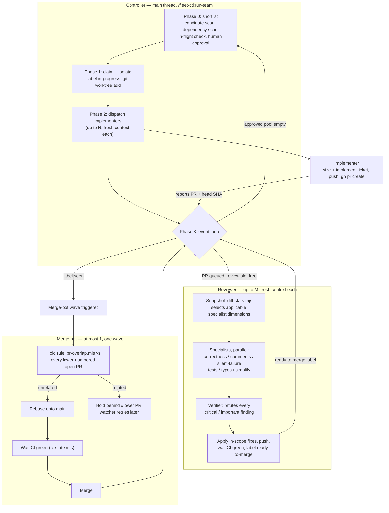

# fleet-ctl

The agent fleet: a `run-team` controller, a merge bot, a PR reviewer, and the
ticket pipeline they share. Ships as the Claude Code / omp plugin
`fleet-ctl@fleet-plugin`.

## Installation

Shipped scripts run under your own `node`. `.nvmrc` pins the dev/CI runtime
the suite is verified against, not a floor
([ADR 0010](docs/adr/0010-the-node-pin-stays-exact-and-a-bot-moves-it.md)).

Supported platforms: macOS, Linux, and Windows via WSL. Native Windows is not
supported ([ADR 0009](docs/adr/0009-supported-platforms-are-macos-linux-wsl.md)).

Claude Code clones the marketplace over SSH; omp clones the marketplace
shorthand over HTTPS.

**Claude Code**

```
/plugin marketplace add feigi/fleet-plugin
/plugin install fleet-ctl@fleet-plugin
```

**omp**

Two settings are session-wide, install-time preconditions on omp (ADR 0003
points 8–9) — plugin agents are invisible without the first, and
`run-team`'s implementer dispatch pool can't open without the second:

```
omp config get enabledProviders          # inspect first: the next line REPLACES the whole list
omp config set enabledProviders '["claude-plugins"]'   # merge in any providers you already had enabled
omp config set eval.workpool.freshAgents true
omp plugin marketplace add feigi/fleet-plugin --scope=user
omp plugin install fleet-ctl@fleet-plugin --scope=user
```

The qualified id (`fleet-ctl@fleet-plugin`) is canonical on both harnesses —
an unqualified `fleet-ctl` install is not guaranteed to resolve to this
plugin. Background: [`docs/adr/0006-rename-to-fleet-ctl.md`](docs/adr/0006-rename-to-fleet-ctl.md).

## Quickstart

Start a fleet run over the `ready-for-agent` queue — up to 5 implementers and
up to 5 reviewers (both optional, default 5, capped at 5), plus one
non-configurable merge bot:

```
/fleet-ctl:run-team [implementers] [reviewers]
```

`run-team` is invoke-only and hidden from both harnesses' `/` picker — type
the command above exactly rather than selecting it; if it doesn't show up,
`/fleet-ctl:run-team-help` prints the exact invocation for you.

This runs `next-ticket` (claim and size a ticket), `review-and-fix` (review a
PR, apply recommended actions, push, watch checks), and `run-merge-bot`
(rebase, wait green, merge) as one coordinated fleet. Each is also invocable
on its own:

- `/fleet-ctl:review-and-fix [pr-number]` — review a PR, apply recommended
  actions, push, watch checks until green.
- `/fleet-ctl:run-merge-bot` — merge every `ready-to-merge` open PR in
  numeric order.
- `next-ticket` skill — pick a ready ticket by intent rather than number,
  implement it, and open a PR rebased on `origin/main`.
- `sizing-a-ticket` skill — decide how much process a ticket needs before
  implementing it.

Run the test suite from the repo root — the glob only expands there, and a
wrong directory silently exits 0 with zero tests run:

```
node --test plugin/scripts/*.test.mjs
```

## How it works

`/fleet-ctl:run-team` is a **controller** running in your own main thread —
never a subagent — that drives three short-lived, fresh-context member roles
over one repo's ticket queue. Standalone commands (`review-and-fix`,
`run-merge-bot`, the `next-ticket` skill) are the same roles run one
ticket/PR at a time, with no controller above them. Full design rationale:
[`docs/specs/2026-07-22-run-team-agent-fleet-design.md`](docs/specs/2026-07-22-run-team-agent-fleet-design.md).

**Controller loop** (phase 0 → 3, repeating until the queue drains):

1. **Shortlist** — scan `ready-for-agent` issues, drop anything with an
   unresolved dependency or already in flight (open PR, remote branch, or
   local worktree), then a human approves the survivor pool. The fleet never
   touches `ready-for-human` work — there's no channel back to a human
   mid-run.
2. **Claim + isolate** — serially, in the main checkout: label the issue
   `in-progress`, `git worktree add` a dedicated tree per ticket.
3. **Dispatch** — spawn up to N implementers in the background, one per
   claimed ticket, each a brand-new agent (never a resumed one — that would
   drag the previous ticket's context into this one).
4. **Event loop** — react without blocking: an implementer's PR gets queued
   for review; a free review slot picks up the next queued PR; a reviewer
   that lands the `ready-to-merge` label triggers a merge-bot wave; the pool
   emptying re-runs the shortlist.

**Reviewer fan-out** — each reviewer cuts a read-only snapshot, sizes the PR,
and dispatches the applicable subset of six specialist agents in parallel
(`fleet-review-correctness`, `-comments`, `-silent-failure`, `-tests`,
`-types`, `-simplify` — correctness always runs, the rest scale to what the
diff actually touches). A verifier adversarially tries to refute every
`critical`/`important` finding before it's trusted; `suggestion`-severity
findings get no verifier by policy and are the reviewer's own job to check.
Confirmed findings in scope get applied, pushed, and waited to CI-green
before the PR is labelled `ready-to-merge`.

**Merge bot** — one wave, at most one bot at a time: for each
`ready-to-merge` PR in numeric order, hold if a lower-numbered open PR
touches related work, otherwise rebase onto `main`, wait for CI green, merge.



## Documentation

- [`CONTEXT.md`](CONTEXT.md) — glossary: the vocabulary (claims, worktrees,
  releases, the merge gate, dispatch, tiers) this repo's artefacts share.
- [`docs/adr/`](docs/adr) — accepted architecture decisions and the
  measurements behind each one.
- [`docs/specs/`](docs/specs) — design docs including the fleet, the
  cockpit, the reviewer's read rules, and member-outcomes instrumentation.
- [`docs/agents/`](docs/agents) — how the engineering skills consume this
  repo's domain docs, plus the triage-label and issue-tracker mappings.

## License

Apache-2.0 — see [`LICENSE`](LICENSE) and [`NOTICE`](NOTICE).
