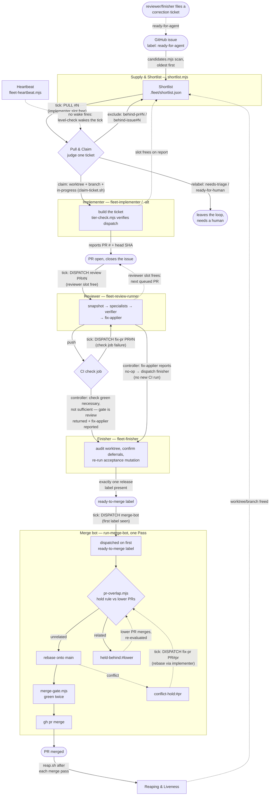

# fleet-ctl

The agent fleet: a `run-team` controller, a merge bot, a PR reviewer, and the
ticket pipeline they share. Ships as the omp.sh extension package
`@feigi/fleet-ctl`.

## Installation

Shipped scripts run under your own `node`, and need at least the version
`engines.node` in [`package.json`](package.json) declares — `>=20.11.0`
today, swept against the shipped tree by `node-floor-sweep.test.mjs`.
`.nvmrc` pins the dev/CI runtime the suite is verified against, a separate,
higher pin, not the floor
([ADR 0010](docs/adr/0010-the-node-pin-stays-exact-and-a-bot-moves-it.md)).

Supported platforms: macOS, Linux, and Windows via WSL. Native Windows is not
supported ([ADR 0009](docs/adr/0009-supported-platforms-are-macos-linux-wsl.md)).

One install-time precondition, operator-set: `modelRoles.slow|task|smol`
pointing at models this install has — the fleet's tier routes (ADR 0011,
ADR 0014, ADR 0021).

```
omp plugin install @feigi/fleet-ctl
~/.fleet/bin/fleet-run tier-roles.mjs --check
```

Working on the plugin itself (this checkout): link the package instead, so
agent and command edits take effect without a reinstall —
`omp plugin link <checkout>/plugin`. A linked root outranks every installed
copy of the same names until you `omp plugin uninstall @feigi/fleet-ctl`, so keep
it to the box you develop on.

`@feigi/fleet-ctl` is the npm package the fleet publishes on every release —
the `@feigi` scope is the collision guard (only its owner can publish under
it). Publishing authenticates via [npm trusted publishing](https://docs.npmjs.com/trusted-publishers/)
(OIDC, no stored token): `@feigi/fleet-ctl` must exist on the registry and have
this repo's `release.yml` configured as its Trusted Publisher before the
first automated release — see ADR 0021, Consequences, for the one-time
bootstrap. Until then the release job fails at its publish step and the
install above answers 404. Background:
[`docs/adr/0006-rename-to-fleet-ctl.md`](docs/adr/0006-rename-to-fleet-ctl.md).

The plugin also ships an omp extension, `member-write-guard`, which refuses a
fleet member's write into the main checkout
([ADR 0020](docs/adr/0020-member-write-boundary-is-enforced-by-a-shipped-omp-extension.md)).
An existing install picks up a new release with `omp plugin install
@feigi/fleet-ctl@latest` followed by a session restart; extensions load only at
session start.

## Quickstart

Start a fleet run over the `ready-for-agent` queue — implementers and reviewers
(both optional, default 2 and 6, no hard cap), plus one
non-configurable merge bot:

```
/skill:run-team [implementers] [reviewers]
```

`run-team` is invoke-only and hidden from the `/` picker — type
the command above exactly rather than selecting it; if it doesn't show up,
`/run-team-help` prints the exact invocation for you.

This runs `next-ticket` (claim and size a ticket), `review-and-fix` (review a
PR, apply recommended actions, push, watch checks), and `run-merge-bot`
(rebase, wait green, merge) as one coordinated fleet. Each is also invocable
on its own:

- `/review-and-fix [pr-number]` — review a PR, apply recommended
  actions, push, watch checks until green.
- `/run-merge-bot` — merge every `ready-to-merge` open PR in
  numeric order.
- `next-ticket` skill — pick a ready ticket by intent rather than number,
  implement it, and open a PR rebased on `origin/main`.
- `sizing-a-ticket` skill — decide how much process a ticket needs before
  implementing it.

Run the test suite from the repo root — the glob only expands there, and a
wrong directory silently exits 0 with zero tests run:

```
node --test plugin/scripts/*.test.mjs
```

## How it works

`/skill:run-team` is a **controller** running in your own main thread —
never a subagent — that turns one repo's `ready-for-agent` issues into
merged PRs by dispatching fresh, short-lived members: implementer, reviewer,
finisher, merge bot. Standalone commands (`review-and-fix`, `run-merge-bot`,
the `next-ticket` skill) run the same roles one ticket/PR at a time, with no
controller above them. Full design rationale:
[`docs/specs/2026-07-22-run-team-agent-fleet-design.md`](docs/specs/2026-07-22-run-team-agent-fleet-design.md);
the loop's current slot-based shape, drawn below, is
[`docs/specs/2026-09-24-slot-based-fleet-loop-design.md`](docs/specs/2026-09-24-slot-based-fleet-loop-design.md)
(ADR 0012/0013).

Every box below is documented on its own page under
[`docs/components/`](docs/components/README.md). Solid arrows are work
flowing forward; dashed arrows are wakes or feedback; an edge labelled
`tick:` is the action `fleet-tick.mjs` prints after every wake, which the
controller then executes. An edge labelled `controller:` is the
controller's own direct decision off a gate condition — dispatching the
finisher and splitting on the CI check job's result are both this kind,
never a `tick:`-printed row.


```mermaid
flowchart TD
    ISSUE(["GitHub issue<br/>label: ready-for-agent"]) -->|"candidates.mjs scan,<br/>oldest first"| SL

    subgraph SUPPLY["Supply &amp; Shortlist — shortlist.mjs"]
        SL["Shortlist<br/>.fleet/shortlist.json"]
    end

    SL -->|"tick: PULL #N<br/>(implementer slot free)"| JUDGE{"Pull &amp; Claim<br/>judge one ticket"}
    JUDGE -->|"relabel: needs-triage /<br/>ready-for-human"| OUT(["leaves the loop,<br/>needs a human"])
    JUDGE -->|"exclude: behind-pr#N /<br/>behind-issue#N"| SL
    JUDGE -->|"claim: worktree + branch +<br/>in-progress (claim-ticket.sh)"| IMPL

    subgraph IMPLSUB["Implementer — fleet-implementer / -alt"]
        IMPL["build the ticket<br/>tier-check.mjs verifies dispatch"]
    end
    IMPL -.->|"slot frees on report"| SL
    IMPL -->|"reports PR # + head SHA"| PR(["PR open, closes the issue"])

    PR -->|"tick: DISPATCH review PR#N<br/>(reviewer slot free)"| REVIEW

    subgraph REVIEWSUB["Reviewer — fleet-review-runner"]
        REVIEW["snapshot → specialists → verifier<br/>→ fix-applier"]
    end
    REVIEW -.->|"reviewer slot frees:<br/>next queued PR"| PR
    REVIEW -->|"push"| CI{"CI check job"}
    CI -->|"tick: DISPATCH fix-pr PR#N<br/>(check job failure)"| REVIEW
    CI -->|"controller: check green necessary,<br/>not sufficient — gate is review<br/>returned + fix-applier reported"| FINISH
    REVIEW -->|"controller: fix-applier reports<br/>no-op → dispatch finisher<br/>(no new CI run)"| FINISH

    subgraph FINISHSUB["Finisher — fleet-finisher"]
        FINISH["audit worktree, confirm deferrals,<br/>re-run acceptance mutation"]
    end
    FINISH -->|"exactly one release<br/>label present"| RTM(["ready-to-merge label"])
    RTM -->|"tick: DISPATCH merge-bot<br/>(first label seen)"| MB

    subgraph MERGEBOTSUB["Merge bot — run-merge-bot, one Pass"]
        MB["dispatched on first<br/>ready-to-merge label"]
        HOLD{"pr-overlap.mjs<br/>hold rule vs lower PRs"}
        MB --> HOLD
        HOLD -->|"unrelated"| REBASE["rebase onto main"] --> GATE["merge-gate.mjs<br/>green twice"] --> MERGE["gh pr merge"]
        HOLD -->|"related"| WAIT["held-behind:#lower"]
        WAIT -.->|"lower PR merges,<br/>re-evaluated"| HOLD
        REBASE -.->|"conflict"| CONFLICT["conflict-hold:#pr"]
        CONFLICT -.->|"tick: DISPATCH fix-pr PR#pr<br/>(rebase via implementer)"| HOLD
    end
    MERGE --> MERGED(["PR merged"])

    MERGED -->|"reap.sh after<br/>each merge pass"| REAP["Reaping &amp; Liveness"]
    REAP -.->|"worktree/branch freed"| SL

    HEART["Heartbeat<br/>fleet-heartbeat.mjs"] -.->|"no wake fires:<br/>level-check wakes the tick"| JUDGE

    CORR(["reviewer/finisher files a<br/>correction ticket"]) -.->|"ready-for-agent"| ISSUE
```

No batching and no maintainer queue: the controller keeps an ordered
**Shortlist** and performs a **Pull** the instant an implementer slot frees —
one ticket judged, then claimed, relabelled by cause, or excluded
([Supply & Shortlist](docs/components/supply-and-shortlist.md),
[Pull & Claim](docs/components/pull-and-claim.md)). Every 5th Pull dispatches
at the alternate tier as a running comparison
([Tier routing](docs/components/tier-routing.md)). Reviews and the merge bot
run off the controller's own turn, as background members it reacts to
rather than waits on
([Reviewer](docs/components/reviewer.md),
[Finisher](docs/components/finisher.md),
[Merge bot](docs/components/merge-bot.md)). One `fleet-tick.mjs` call per
wake records what happened and recomputes every role's deficit against
`.fleet/ledger.md` — the same reconcile a drained Shortlist's own heartbeat
re-triggers when no event would otherwise fire
([Ledger & Cockpit](docs/components/ledger-and-cockpit.md),
[Reaping & Liveness](docs/components/reaping-and-liveness.md)).

## Documentation

- [`docs/requirements.md`](docs/requirements.md) — trying it on your own
  repo: what the repo, the machine, and the team's process must satisfy,
  with a copy-paste pre-flight.
- [`CONTEXT.md`](CONTEXT.md) — glossary: the vocabulary (claims, worktrees,
  releases, the merge gate, dispatch, tiers) this repo's artefacts share.
- [`docs/components/`](docs/components/README.md) — one page per
  fleet-ctl component: what it's for, how it works, and the opinionated
  design choices behind it.
- [`docs/adr/`](docs/adr) — accepted architecture decisions and the
  measurements behind each one.
- [`docs/specs/`](docs/specs) — design docs including the fleet, the
  cockpit, the reviewer's read rules, and member-outcomes instrumentation.
- [`docs/agents/`](docs/agents) — how the engineering skills consume this
  repo's domain docs, plus the triage-label and issue-tracker mappings.

## License

Apache-2.0 — see [`LICENSE`](LICENSE) and [`NOTICE`](NOTICE).
