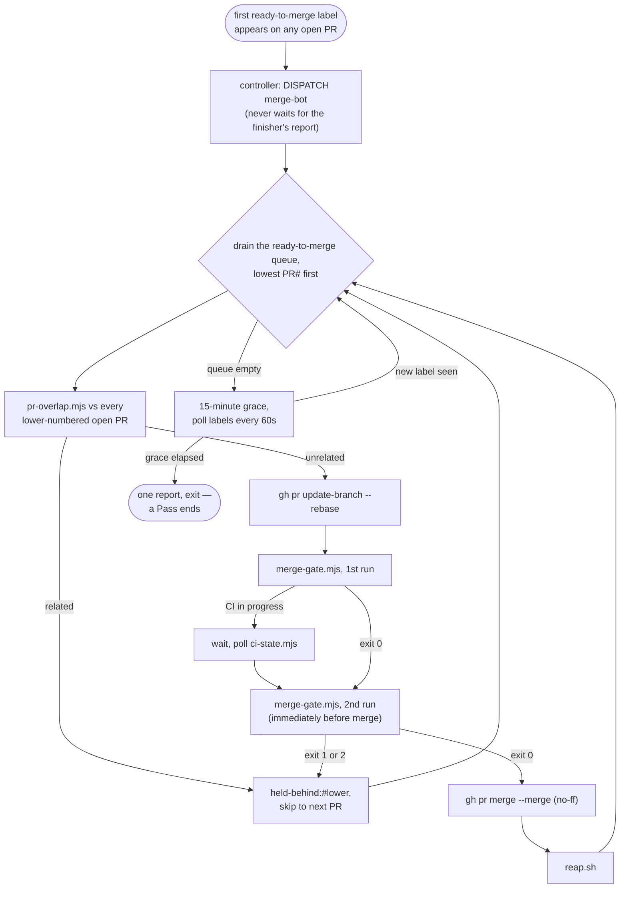

# Merge bot

## What it is for

The single agent that turns a `ready-to-merge` label into a merged PR. At
most one runs at a time, named `merge-bot-<n>`, and its whole lifetime is
one **Pass**.

## How it works

The controller dispatches a merge bot the instant the *first*
`ready-to-merge` label appears on any open PR — it never waits for the
[Finisher](finisher.md)'s own report — telling it to follow
[`plugin/commands/run-merge-bot.md`](../../plugin/commands/run-merge-bot.md)
for one Pass. The bot drains the `ready-to-merge` queue in numeric PR
order, lowest first, re-evaluating selection from the top after every
merge (a merge invalidates every other open PR's CI currency). Per PR:
[`pr-overlap.mjs`](../../plugin/scripts/pr-overlap.mjs) checks every
lower-numbered open PR for shared files, shared module basenames, shared
top-level directories, or diff prose that cites a data file the other PR
touches — any signal firing holds this PR as `held-behind:#<lower>`
rather than merge out of order; an unrelated PR is rebased server-side
(`gh pr update-branch --rebase`), then
[`merge-gate.mjs`](../../plugin/scripts/merge-gate.mjs) (a read-only
conjunction of [Instruments](instruments.md), `gh pr view`, and
[CI State](ci-state.md)) is run once, waited on if CI is still in
progress, then run again immediately before `gh pr merge` — merging only
on that **second** exit 0, because the first run is what triggers the CI
cycle a stale rebase could otherwise merge behind. A genuine textual
rebase conflict is recorded as `conflict-hold:#<pr>` and cleared only
when a fix-applier dispatched against it settles as landed — distinct
from `held-behind`, which is an ordering deference to a lower PR, never a
conflict. Once nothing is left to merge, the bot holds a 15-minute grace
polling labels every 60s for late arrivals, then reports every PR it
touched exactly once and exits; a label landing after exit dispatches a
fresh `merge-bot-<n+1>` immediately. After every merge,
[`reap.sh`](../../plugin/scripts/reap.sh) deletes the merged PR's now-
`[gone]` local branch and worktree — see
[Reaping & Liveness](reaping-and-liveness.md).

## Opinionated choices

Merge only on `merge-gate.mjs`'s **second** exit 0, never the first:
currency (whether a required check passed against the *current* base
tip) can silently go stale in the window a rebase opens, so the gate is
re-read immediately before the merge call rather than trusted from the
pre-rebase read ([ADR 0007](../adr/0007-main-ruleset-is-the-merge-gate.md),
`docs/specs/2026-09-24-slot-based-fleet-loop-design.md` §5). `--merge`,
never `--squash`/`--rebase`, is the only method the bot calls:
[`prove-merge.sh`](../../plugin/scripts/prove-merge.sh) can only verify a
two-parent commit landed, and that proof is load-bearing, not stylistic.
A deliberately low-tier (haiku) model runs the bot on the argument that
its job is checklist work and
[`no-undo-audit.sh`](../../plugin/scripts/no-undo-audit.sh), run before
every rebase, is the deterministic backstop that catches a wrongly-
resolved conflict regardless of tier. Rejecting GitHub's native merge
queue was deliberate: its `merge_group` event has no workflow in this
repo, and a behind PR would enter the queue with a red `rebase-check` by
design — the fleet's own label+hold-rule queue is what makes currency
enforceable at all ([ADR 0007](../adr/0007-main-ruleset-is-the-merge-gate.md)).
