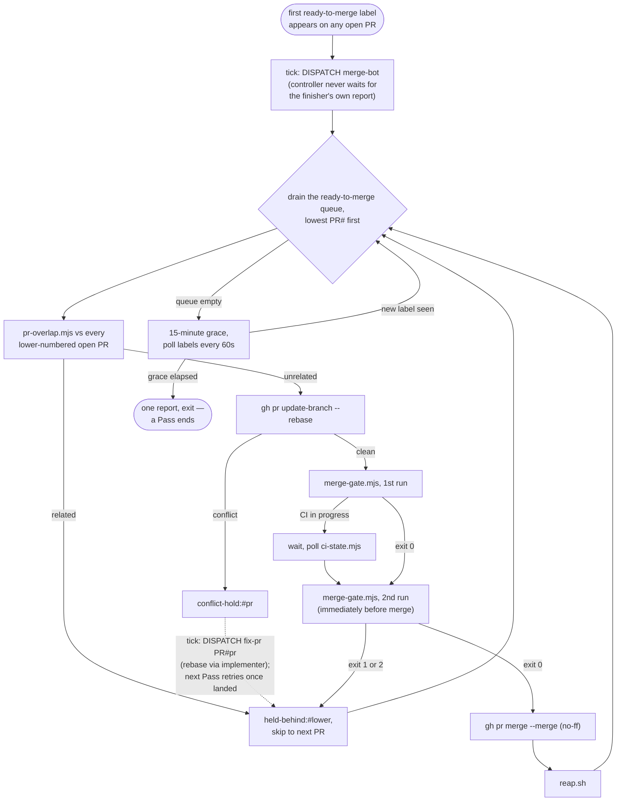

# Merge bot

## What it is for

The single agent that turns a `ready-to-merge` label into a merged PR.
At most one runs at a time, named `merge-bot-<n>`, and its whole
lifetime is one **Pass**.

## How it works
1. **Dispatch.** The controller dispatches a merge bot the instant the
   *first* `ready-to-merge` label appears on any open PR — never
   waiting for the [Finisher](finisher.md)'s own report — to run
   [`plugin/commands/run-merge-bot.md`](../../plugin/commands/run-merge-bot.md)
   for one Pass.
2. **Drain the queue**, lowest PR# first, re-evaluating from the top
   after every merge (a merge invalidates every other open PR's CI
   currency).
3. **Per PR**, [`pr-overlap.mjs`](../../plugin/scripts/pr-overlap.mjs)
   checks every lower-numbered open PR for shared files, module
   basenames, top-level directories, or diff-prose citing a shared data
   file — any signal holds this PR as `held-behind:#<lower>`.
4. **Rebase** an unrelated PR server-side (`gh pr update-branch
   --rebase`). A genuine conflict is recorded as `conflict-hold:#<pr>`
   instead — distinct from `held-behind` — and cleared only once a
   fix-applier dispatched against it settles as landed.
5. **Gate twice:** [`merge-gate.mjs`](../../plugin/scripts/merge-gate.mjs)
   (a read-only conjunction of [Instruments](instruments.md), `gh pr
   view`, the main-gain check
   [`main-gain.mjs`](../../plugin/scripts/main-gain.mjs), and
   [CI State](ci-state.md)) runs once, waits on CI if in
   progress, then runs again immediately before `gh pr merge` — merging
   only on that **second** exit 0.
6. **Grace, then exit.** Once nothing is left to merge, hold a
   15-minute grace polling labels every 60s; a label landing after exit
   dispatches a fresh `merge-bot-<n+1>` immediately.
7. **Reap.** After every merge,
   [`reap.sh`](../../plugin/scripts/reap.sh) deletes the merged PR's
   `[gone]` branch and worktree — see
   [Reaping & Liveness](reaping-and-liveness.md).

## Opinionated choices

- **Merge only on the gate's second exit 0.** Currency can go stale in
  the window a rebase opens, so the gate is re-read immediately before
  merging rather than trusted from the pre-rebase read
  ([ADR 0007](../adr/0007-main-ruleset-is-the-merge-gate.md)).
- **`--merge`, never `--squash`/`--rebase`.**
  [`prove-merge.sh`](../../plugin/scripts/prove-merge.sh) can only
  verify a two-parent commit landed, and that proof is load-bearing.
- **A deliberately low tier** ([Tier routing](tier-routing.md)). The
  job is checklist work, and
  [`no-undo-audit.sh`](../../plugin/scripts/no-undo-audit.sh), run
  before every rebase, is the deterministic backstop that catches a
  wrongly-resolved conflict regardless of tier. Its post-rebase
  counterpart is the gate's main-gain row, which refuses a merge that
  would remove lines `main` gained after the PR's work began unless the
  PR body acknowledges them
  ([ADR 0023](../adr/0023-main-gain-check-is-a-merge-gate-row.md)).
- **GitHub's native merge queue is rejected.** Its `merge_group` event
  has no workflow in this repo, and a behind PR would enter the queue
  with a red `rebase-check` by design — the fleet's own label+hold-rule
  queue is what makes currency enforceable at all
  ([ADR 0007](../adr/0007-main-ruleset-is-the-merge-gate.md)).
