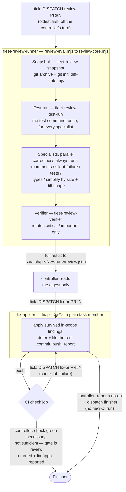

# Reviewer

## What it is for

Turns one open PR into either a merge-ready candidate or a set of
findings, filed or applied — the fan-out review pipeline dispatched per
PR, off the controller's own turn.

## How it works
1. **Dispatch.** The tick names every PR owed a review, oldest first;
   the controller dispatches `review-pr-<pr#>` as
   [`fleet-review-runner`](../../plugin/agents/fleet-review-runner.agent.md),
   recording `review=member:review-pr-<pr#>` first.
2. **Snapshot & specialists.** The runner's `eval` cell calls the omp
   shim [`review-eval.mjs`](../../plugin/scripts/review-eval.mjs)
   (wrapping [`review-core.mjs`](../../plugin/scripts/review-core.mjs)).
   [`fleet-review-snapshot`](../../plugin/agents/fleet-review-snapshot.agent.md)
   cuts a `git archive`d, `git init`ed snapshot verified against the
   reviewed commit and sized with
   [`diff-stats.mjs`](../../plugin/scripts/diff-stats.mjs).
   [`fleet-review-test-run`](../../plugin/agents/fleet-review-test-run.agent.md)
   then runs the test command once from the snapshot's root, and
   specialists run in parallel over the snapshot, each reading that one
   run's counts and log rather than running the suite itself —
   correctness always, plus comments/silent-failure/tests/types/simplify
   scaled to diff size and shape.
3. **Verify.**
   [`fleet-review-verifier`](../../plugin/agents/fleet-review-verifier.agent.md)
   adversarially refutes every `critical`/`important` finding by
   running something concrete, defaulting to "refuted" only when
   uncertain. `suggestion`-severity findings get a hard 0-refuter
   budget.
4. **Fix.** The full result is written to `<scratch>/pr<pr>/<run>/review.json`,
   in the review's own run root, which the ledger's `reviewed=` token names;
   the controller reads only a digest and dispatches a **fix-applier**
   (`fix-pr-<pr#>`, never the implementer) that applies survived
   in-scope findings, defers and files the rest, commits, and pushes.
5. **CI, then the Finisher — or `no-op`, then the Finisher.** A red
   check job re-dispatches the fix-applier (`tick: DISPATCH fix-pr`).
   Check green makes the PR a finisher *candidate*, not the gate: once
   the review has returned and its fix-applier (if any) has reported,
   that is the controller's own direct cue to dispatch the
   [Finisher](finisher.md) — never a tick-printed row. A fix-applier
   reporting `no-op` satisfies that gate immediately, against the
   existing head, with no new CI run to wait for.

Where the review unit is unavailable or has failed its one retry, the
controller falls back to hand-dispatching the snapshot and specialists
itself — a measured omp spawn restriction on some installs, not a
preference.

## Opinionated choices

- **No human approves the review→merge sequence.** The finisher and
  merge bot are the only gates, justified the same way a low tier is
  acceptable on the merge bot — a deterministic, script-driven backstop
  catches what a cheap agent gets wrong.
- **Suggestions get zero refuter budget.** A plausible-but-wrong finding
  costs more than a missed one, so the pipeline is biased toward
  refusal where being wrong is expensive.
- **Scope, not severity, decides apply-vs-defer.** In-scope survived
  findings are applied now; everything out of scope defers into a new
  ticket — see [Correction tickets](correction-tickets.md).
- **Two isolated trees, never one shared mutating copy.** A specialist
  reads a pristine, never-written snapshot; a refuter mutates its own
  private copy — a shared read/write tree was measured letting one
  specialist observe another's mid-analysis mutant as if it were real
  code.
